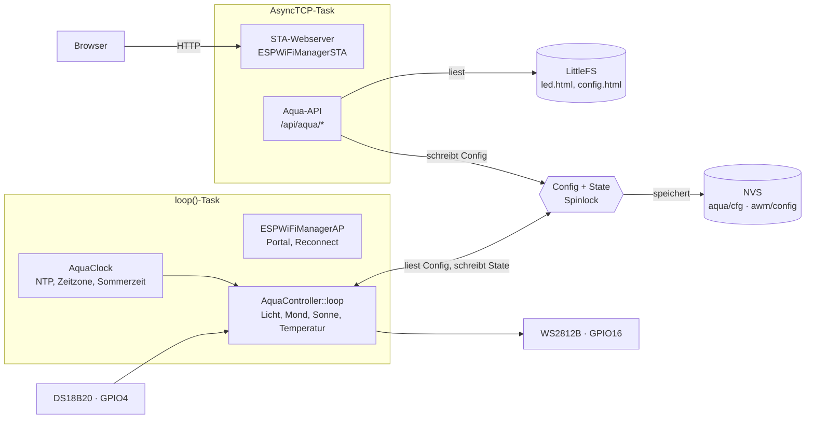

# ESP32 Aquarium-LED-Steuerung – Dokumentation

Stand: 30.09.2026

## Überblick

Die Firmware steuert einen WS2812B-LED-Strip mit bis zu 300 LEDs über einen ESP32 als Aquarium-Tageslicht mit Mondlicht und misst die Wassertemperatur. Die Lichtsteuerung läuft auch ohne WLAN weiter. Bedient wird das Gerät über Webseiten im Heimnetz (STA-Modus).

| Funktion | Kurzbeschreibung |
| --- | --- |
| WLAN-Manager | Captive-Portal zur Ersteinrichtung, automatischer Reconnect, mDNS, OTA-Updates |
| Uhr | NTP-Synchronisation, Zeitzone GMT-12 … GMT+13, EU-Sommerzeit, manuelle Zeiteinstellung |
| Sonne und Mond | Sonnenauf- und -untergang aus Breiten-/Längengrad, Mondalter 0–29 Tage |
| 4 Farbkanäle | Je Kanal Farbe EIN/AUS, Betriebsart UHR/EIN/AUS, zwei Schaltzeiträume |
| Dimmung | 3-stufiges Hoch- und Herunterdimmen an den Schaltzeiten |
| Mondbeleuchtung | Bis zu 3 LED-Bereiche, Helligkeit nach Mondphase |
| Temperatur | DS18B20, Anzeige jede Sekunde, 999.99 bei Sensorfehler |

## Hardware & Verdrahtung

Zielboard ist ein ESP32-WROOM-DA-Modul. Alle Pins sind als `#define` im Sketch `ESP32_Aqua_LEDStrip.ino` änderbar.

| Bauteil | GPIO | Define | Hinweis |
| --- | --- | --- | --- |
| WS2812B-Daten | 16 | `LED_STRIP_PIN` | Farbreihenfolge GRB, 800 kHz |
| DS18B20-Daten | 4 | `ONEWIRE_PIN` | 4,7 kΩ Pull-up nach 3,3 V |
| Status-LED | 2 | `LED_PIN` | Zeigt WLAN-/Portal-Zustand |
| Taster | 0 | `BTN_PIN` | BOOT-Taste, LOW-aktiv; -1 deaktiviert die Laufzeit-Abfrage |

- Den Strip aus einem eigenen 5-V-Netzteil versorgen und die Masse mit dem ESP32 verbinden. Eine WS2812B zieht bei vollem Weiß bis etwa 60 mA, 300 LEDs also bis etwa 18 A.
- Der ESP32 gibt 3,3-V-Pegel aus. Bei langen Leitungen oder Fehlfarben einen Pegelwandler (z. B. 74AHCT125) in die Datenleitung setzen.
- Für den DS18B20 im Wasser die wasserdichte Ausführung mit Edelstahlhülse verwenden.

## Build & Flashen

Gebaut wird mit Visual Studio + vMicro (oder `arduino-cli`) gegen den ESP32-Core 3.3.12. ElegantOTA muss auf den Async-Webserver umgestellt sein (`ELEGANTOTA_USE_ASYNC_WEBSERVER 1` in `ElegantOTA.h` der Bibliothek); sonst scheitert das Linken.

| Bibliothek | Version | Zweck |
| --- | --- | --- |
| ESP Async WebServer + Async TCP | 3.10.3 | Webserver für Portal und STA |
| ElegantOTA | Async-Modus | Firmware-Update unter `/update` |
| ArduinoJson | 7.x | Konfiguration und API |
| Adafruit NeoPixel | 1.15.4 | WS2812B-Ausgabe |
| OneWire / DallasTemperature | 2.3.8 / 4.0.6 | DS18B20 |
| sunMoon + Time (TimeLib) | – / 1.6.1 | Sonnenzeiten und Mondalter |

1. Partitionsschema `partitions.csv` verwenden: 2 App-Slots zu je 0x1C0000, LittleFS 0x60000 ab 0x3A0000. Mit dem Standardschema ist der Programmspeicher zu 93 % belegt, mit dem eigenen zu etwa 66 %.
2. Neue `.cpp`-Dateien unter `src\` müssen in `ESP32_Aqua_LEDStrip.vcxproj` eingetragen sein, sonst kompiliert vMicro sie nicht.
3. Firmware per USB flashen oder per OTA: `.\App-OTA.ps1 -Ip <ESP-IP>` bzw. im Browser unter `http://<ESP-IP>/update`.
4. Web-Dateien aus `data\` als LittleFS-Image hochladen: seriell `.\LittleFS.ps1 -Flash -Port COM4` oder per WLAN `.\LittleFS-OTA.ps1 -Ip <ESP-IP>`. Nach Änderungen an HTML/CSS ist dieser Schritt immer nötig.

Einstellungen liegen im NVS und überleben Firmware- und LittleFS-Updates.

## Inbetriebnahme & WLAN

Ohne gespeicherte Zugangsdaten öffnet das Gerät ein Captive-Portal: WLAN `WiFi Manager` (Passwort `123456789`), Seite `http://192.168.4.1`. Dort Netz wählen, Passwort eingeben und speichern; das Gerät startet neu und verbindet sich mit dem Heimnetz.

1. Nach dem Einschalten blinkt die Status-LED 2 s langsam. Wird der Taster in dieser Zeit gedrückt, zählt die Haltedauer.
2. Taster 2–5 s halten → Portal öffnet sich. Taster ≥ 5 s halten → Zugangsdaten werden gelöscht, Neustart.
3. Ohne Tastendruck verbindet sich das Gerät mit dem gespeicherten WLAN (Timeout 15 s), synchronisiert die Uhr und startet mDNS (`<hostname>.local`). Schlägt das fehl, öffnet sich das Portal.
4. Im Betrieb öffnet ein Tastendruck ≥ 0,7 s das Portal zur Neukonfiguration.
5. Bei Verbindungsverlust versucht das Gerät alle 10 s einen Reconnect. Nach 60 s ohne Verbindung öffnet sich das Portal.
6. Mit gespeicherten Zugangsdaten schließt sich das Portal nach 300 s ohne Zugriff und der Reconnect läuft weiter.

Im Heimnetz ist die Startseite unter `http://<ESP-IP>/` oder `http://<hostname>.local/` erreichbar. Sie verlinkt auf LED-Steuerung, Konfiguration und WLAN-Einstellungen.

| Status-LED | Bedeutung |
| --- | --- |
| Dauerhaft an | Mit WLAN verbunden |
| Langsam blinkend (1 Hz) | Portal aktiv bzw. Boot-Wartezeit |
| Schnell blinkend (5 Hz) | WLAN-Scan läuft / Taster beim Boot < 2 s gehalten |
| Doppelblitz | Taster beim Boot 2–5 s gehalten |
| Dreifachblitz | Taster ≥ 5 s: Zugangsdaten werden gelöscht |
| Aus | Nicht verbunden, kein Portal |

## Bedienung: LED-Steuerung (`/led`)

Oben zeigt die Seite den Live-Status, darunter alle Lichteinstellungen; „Speichern“ übernimmt sie sofort und dauerhaft.

**Status** (Aktualisierung jede Sekunde)

- Uhrzeit mit Sommer-/Normalzeit, Datum und NTP-Status in der Kopfzeile
- Wassertemperatur in °C, rot `999.99` bei Sensorfehler
- Sonnenaufgang – Sonnenuntergang (Lokalzeit)
- Mondalter in Tagen und Mondhelligkeit (/256)
- Je Kanal ein Farbfeld mit aktueller Farbe und Helligkeit in %, dazu der Mond an/aus

**Einstellungen**

| Feld | Werte | Wirkung |
| --- | --- | --- |
| Anzahl LEDs | 1–300 | LEDs darüber hinaus bleiben dunkel |
| Dauer je Stufe | 0–120 min | 0 = hart schalten ohne Dimmung |
| Stufen 1–3 | je 1–100 % | Helligkeit der drei Dimmstufen, Standard 33 / 66 / 100 % |
| Kanal: Betriebsart | UHR / EIN / AUS | UHR = nach Schaltzeiten, EIN/AUS = Handbetrieb |
| Kanal: Farbe EIN / AUS | Farbwähler | Tag- bzw. Nachtfarbe des Kanals |
| Kanal: Zeitraum 1 und 2 | HH:MM bis HH:MM | Kanal an, solange die Zeit in einem Zeitraum liegt; gleiche Zeiten = deaktiviert |
| Mond: Betriebsart | AUTO / EIN / AUS | siehe Funktionsweise |
| Mond: Farbe | Farbwähler | Grundfarbe, wird nach Mondphase gedimmt |
| Mond: LEDs | `von-bis;einzeln;von-bis` | max. 3 Einträge, z. B. `37-48;67-78;107-118` |

Fehlerhafte Eingaben werden nicht gespeichert; die Seite zeigt den Grund (z. B. „Mond-Bereich außerhalb 1–300“).

## Bedienung: Konfiguration (`/config`)

Hier werden Uhr und Standort eingestellt; die Kopfzeile zeigt die aktuelle Gerätezeit.

| Feld | Werte | Hinweis |
| --- | --- | --- |
| NTP-Status | nie gesetzt / Synchronisierung fehlgeschlagen / synchronisiert | mit Zeitpunkt der letzten Synchronisierung |
| NTP-Server | Hostname, max. 63 Zeichen | leer = `us.pool.ntp.org`; gleiches Feld wie „NTP 1“ in den WLAN-Einstellungen |
| Zeitzone | GMT-12 … GMT+13 | Standardzeit, Deutschland = GMT+1 |
| Sommer-/Winterzeit | an / aus | EU-Regel, +1 h |
| Breitengrad | -90 … 90 | Dezimalgrad, Nord positiv |
| Längengrad | -180 … 180 | Dezimalgrad, Ost positiv |

**Manuelle Zeiteinstellung:** Datum und Uhrzeit (Lokalzeit) eingeben oder „Zeit dieses Geräts übernehmen“ wählen, dann „Uhrzeit setzen“. Bei aktiver NTP-Verbindung überschreibt die nächste Synchronisierung die manuelle Zeit.

Nach Änderung des NTP-Servers wird sofort neu synchronisiert. Antwortet der Server nicht innerhalb von 30 s, zeigt der Status „Synchronisierung fehlgeschlagen“.

## Funktionsweise im Detail

### Kanäle und Schaltzeiten

Die LEDs werden reihum auf 4 Kanäle verteilt: LED n gehört zu Kanal ((n − 1) mod 4) + 1, also Kanal 1 = LED 1, 5, 9, … Im Modus UHR ist ein Kanal an, solange die Uhrzeit in Zeitraum 1 oder 2 liegt. Ein Zeitraum mit EIN > AUS läuft über Mitternacht (z. B. 22:00–02:00). Ohne gültige Uhrzeit bleiben UHR-Kanäle aus.

### Dimm-Rampe (Sonnenauf- und -untergang)

In den ersten Minuten eines Zeitraums läuft der Kanal durch die Stufen 1 → 2 → 3, in den letzten Minuten rückwärts. Die Farbe wird dabei linear zwischen AUS-Farbe (0 %) und EIN-Farbe (100 %) gemischt. Ist ein Zeitraum kürzer als 4 Stufen, gilt jeweils die niedrigere der beiden Stufen. Liegen beide Zeiträume gleichzeitig an, gilt die höhere Helligkeit.

Beispiel: Zeitraum 10:00–13:00, 10 min je Stufe, Standardstufen 33 / 66 / 100 %:

| Uhrzeit | Helligkeit |
| --- | --- |
| vor 10:00 | aus (AUS-Farbe) |
| 10:00–10:10 | 33 % |
| 10:10–10:20 | 66 % |
| 10:20–12:40 | 100 % |
| 12:40–12:50 | 66 % |
| 12:50–13:00 | 33 % |
| ab 13:00 | aus (AUS-Farbe) |

Mit 0 min je Stufe schaltet der Kanal hart ein und aus.

### Mondbeleuchtung

| Mond-Modus | Kanäle | Mond-LEDs |
| --- | --- | --- |
| AUTO | laufen normal (UHR/EIN/AUS) | an, sobald kein Kanal eingeschaltet ist; Helligkeit nach Mondphase |
| EIN | alle dunkel | an mit fester Vollmond-Helligkeit 30/256 |
| AUS | alle dunkel | aus (Strip komplett dunkel) |

Im Modus AUTO ist die Helligkeit 2 × Tage bis bzw. seit Neumond, also 0/256 bei Neumond bis 30/256 bei Vollmond (Mondalter 15). Leuchtet der Mond, überschreibt er die Kanalfarbe der Mond-LEDs; die übrigen LEDs zeigen ihre AUS-Farbe.

### Uhr und Sommerzeit

Die Systemzeit läuft in UTC und wird per SNTP (UDP-Port 123) gestellt. Lokalzeit = UTC + Zeitzone + 1 h, wenn Sommerzeit aktiv ist. Die EU-Regel gilt vom letzten Sonntag im März 01:00 UTC bis zum letzten Sonntag im Oktober 01:00 UTC.

### Sonne, Mond und Temperatur

Sonnenauf- und -untergang sowie das Mondalter berechnet die Bibliothek *sunMoon* einmal pro Minute aus Datum, Zeitzone und Standort. Der DS18B20 misst mit 12 Bit alle 0,8 s ohne Blockieren. Liefert er −127 °C (getrennt) oder 85 °C (Einschaltwert), wird `999.99` angezeigt, und alle 30 s wird der Bus neu durchsucht.

## HTTP-API

Alle Endpunkte laufen auf dem STA-Server (Port 80) und liefern bzw. erwarten JSON.

| Methode | Pfad | Zweck |
| --- | --- | --- |
| GET | `/api/aqua/status` | Live-Werte: Zeit, NTP, Sonne, Mond, Temperatur, Kanalzustände |
| GET | `/api/aqua/settings` | Komplette Konfiguration inkl. NTP-Server und Gerätezeit |
| POST | `/api/aqua/settings` | Teil-Update, `Content-Type: application/json` |
| GET | `/led`, `/config` | Web-Seiten |
| GET/POST | `/api/sta/config` | Netzwerk (DHCP/statisch, Hostname, NTP 1/2) |
| POST | `/erase` | Zugangsdaten löschen und Neustart |
| GET/POST | `/update` | ElegantOTA |

**Antwort `GET /api/aqua/status`**

```json
{"valid":true,"date":"30.09.2026","time":"14:05:12","dstActive":true,
 "ntp":2,"ntpText":"synchronisiert","lastSync":"30.09.2026 13:58",
 "sunrise":"07:08","sunset":"18:52","moonAge":8,"moonBright":16,"moonLit":false,
 "temp":24.56,
 "ch":[{"on":true,"level":100,"color":"#ffffff"}, … 4 Einträge]}
```

`ntp`: 0 = nie gesetzt, 1 = fehlgeschlagen, 2 = synchronisiert.

**Body `POST /api/aqua/settings`** – jeder Block ist optional:

```json
{"leds":120,
 "ramp":{"step":10,"lv":[33,66,100]},
 "ch":[{"mode":0,"on":"#ffffff","off":"#000000",
        "p":[{"on":"10:00","off":"13:00"},{"on":"15:00","off":"21:00"}]}, … genau 4],
 "moon":{"mode":0,"color":"#6080ff","ranges":"37-48;67-78"},
 "tz":1,"dst":true,"lat":52.52,"lon":13.40,
 "ntp":"de.pool.ntp.org",
 "setTime":"2026-09-30T14:05:00"}
```

`mode` bei Kanälen: 0 = UHR, 1 = EIN, 2 = AUS; beim Mond: 0 = AUTO, 1 = EIN, 2 = AUS. Erfolg: `{"ok":true}`; Fehler: HTTP 400/500 mit `{"ok":false,"error":"…"}`, dann wird nichts übernommen.

## Software-Architektur

Webanfragen laufen im AsyncTCP-Task, Licht und Sensoren im `loop()`-Task; beide greifen nur unter einem Spinlock auf Konfiguration und Laufzeitstatus zu.



Die Konfiguration ist eine reine Datenstruktur ohne `String`-Felder und lässt sich deshalb im kritischen Abschnitt kopieren.

| Datei | Aufgabe |
| --- | --- |
| `ESP32_Aqua_LEDStrip.ino` | Start, Taster, Reconnect-Logik, Aufruf aller Module |
| `src/ESPWiFiManagerAP.*` | Captive-Portal, DNS, WLAN-Scan, Reconnect, Status-LED |
| `src/ESPWiFiManagerSTA.*` | Webserver im Heimnetz, `setExtraRoutes()` für die Aqua-Seiten |
| `src/ESPWiFiManagerCommon.*` | NVS-Config, NTP, OTA, Datei-Auslieferung |
| `src/AquaConfig.*` | Datenmodell, JSON-Prüfung, NVS-Namespace `aqua` |
| `src/AquaClock.*` | Lokalzeit, EU-Sommerzeit, NTP-Status, manuelle Zeit |
| `src/AquaController.*` | Dimm-Rampe, Mond, Sonne, DS18B20, Strip-Ausgabe, `/api/aqua/*` |

Der Strip wird nur neu beschrieben, wenn sich Farben oder Mondzustand ändern, spätestens alle 10 s. Die Lichtberechnung läuft alle 250 ms, Sonne und Mond einmal pro Minute.

## Fehlerbehebung

| Symptom | Ursache | Lösung |
| --- | --- | --- |
| Linker: `undefined reference to ElegantOTAClass::begin(AsyncWebServer*, …)` | ElegantOTA-Bibliothek ohne Async-Modus | In `ElegantOTA.h` `ELEGANTOTA_USE_ASYNC_WEBSERVER` auf 1 setzen bzw. den passenden Bibliotheksordner verwenden |
| Linker: `ld returned 1 exit status` in vMicro, `Aqua*.o` fehlen im Build-Ordner | Neue `.cpp` nicht in `ESP32_Aqua_LEDStrip.vcxproj` eingetragen | Datei ins Projekt aufnehmen, Projekt neu laden |
| `expected unqualified-id before 'if'` im Debug-Build | vMicro-Haltepunkt auf der schließenden `}` von `setup()` | Haltepunkt entfernen oder eine Zeile höher setzen, oder Release bauen |
| Temperatur zeigt `999.99` | Kein DS18B20 gefunden, Pull-up fehlt oder Kabelbruch | Verdrahtung und 4,7 kΩ prüfen; der Bus wird alle 30 s neu durchsucht |
| Uhr zeigt `--:--:--`, Kanäle bleiben aus | Noch keine NTP-Zeit, keine manuelle Zeit | Unter `/config` NTP-Server prüfen oder Uhrzeit manuell setzen |
| NTP-Status „fehlgeschlagen“ | Server nicht erreichbar oder UDP 123 gesperrt | Anderen Server eintragen, z. B. `de.pool.ntp.org` |
| `/led` meldet „led.html nicht gefunden“ | LittleFS-Image veraltet | `LittleFS.ps1` bzw. `LittleFS-OTA.ps1` ausführen |
| Neue Seiten ohne Gestaltung | `WifiManager.css` ist 1 Tag im Browser zwischengespeichert | Seite mit Strg+F5 neu laden |
| Falsche Farben am Strip | Farbreihenfolge oder Signalpegel | Strip-Typ GRB prüfen, Pegelwandler einsetzen |
| Sonnenzeiten falsch | Standort oder Zeitzone falsch | Breiten-/Längengrad (Nord/Ost positiv) und GMT-Offset prüfen |

## Sicherheit & offene Punkte

Das Gerät ist für ein vertrauenswürdiges Heimnetz gedacht: Keine Seite und keine API verlangt eine Anmeldung.

- [ ] ElegantOTA mit Benutzer und Passwort schützen (`ElegantOTA.setAuth(…)`); derzeit kann jeder im Netz unter `/update` Firmware einspielen.
- [ ] ArduinoOTA-Passwort setzen (Aufruf `ensureArduinoOta(…, "")` im Sketch).
- [ ] Standard-Portalpasswort `123456789` ändern (`setAPCredentials(…)`).
- [ ] `/erase` und `POST /api/aqua/settings` sind ungeschützt, auch gegen Anfragen fremder Webseiten im Browser (CSRF).
- [ ] Ungenutzte Dateien entfernen: `data/settingsAP.html`, `data/settingsSTA.html` (ca. 28 KB) und die Template-Variante von `serveFileFromLittleFS` in `ESPWiFiManagerCommon.h`.
- [ ] Fallback `SMART_RETRIES` öffnet das Portal, ohne den STA-Server zu stoppen (beide Port 80); mit dem verwendeten `ON_FAIL` tritt das nicht auf.
- [ ] Stromaufnahme begrenzen: Es gibt keine globale Helligkeitsbegrenzung; das Netzteil muss den vollen Strip tragen.
